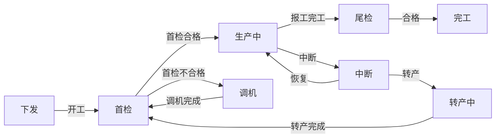

"业务流程很复杂的系统，怎么避免 if-else 地狱？"——这是聊到业务项目时最经典的一问，标准答案是"用状态机"，再往深问就是策略模式、状态模式、Spring StateMachine。但教科书只讲到"怎么写"，没讲真实系统里真正的难点：**状态机规则要不要允许工厂自己改？改了之后在途的单子怎么办？两个工人同时按按钮，状态会不会飞？**

本篇拆这套 MES 的工单状态机——本系列业务味最浓的一篇。前一篇讲的是"所有页面怎么长一个样"，这一篇讲的是"一个工单从下发到完工，怎么在十几个状态之间安全地走完一生"。它的核心答案可能和很多人的直觉相反：**这个系统里最重要的状态机不在 Java 代码里，而在一份可以按工厂配置的流程图 XML 里**。

<!-- more -->

## 一、先建模：三层状态，各管各的

聊状态机先聊状态建模。这套系统的工单状态分三层，粒度和消费者都不同：

- **主表状态**：七种粗粒度状态（未排产、已排产、生产中、转产中、中断、完工、强制截单），面向管理报表和看板——老板关心的是"这单子到哪一步了"，不需要知道是不是在调机；
- **子表状态**：一个子工单对应一道工序，状态细到十八种——除了主表的粗状态，还有"待首检/首检中/待尾检/尾检中/暂停/调机中/待转产/预转产"这类**过渡态**。过渡态是真实流程建模的精髓："开工"不是一个瞬间动作，而是"待首检 → 首检中 → 开工"的三个状态两次迁移，每一步都可追溯；
- **设备最近状态表**：另有一张"设备当前在做什么"的宽表，由每次状态变更顺手维护，供车间大屏直查——**状态被消费的频率决定了它的存储形态**。

为什么要分三层？因为三层的状态变更节奏完全不同：主表状态一天变几次，子表状态一天变几百次，设备状态实时变。混在一张表里，要么锁冲突，要么查询互相拖累。

核心流转画出来是这样（中间的暂停、调机、尾检支线做了简化）：



注意"首检不合格 → 调机 → 重新首检"这个环——它不是设计失误，而是注塑现场的真实：模具温度没调对，第一模就是废品，调完再检。**状态机不是流程图的美化，是把现场的容错路径显式化**。

## 二、教科书答案 vs 真实答案：状态机规则放在哪

面试里答"用状态机"，下一个问题必然是"怎么实现的"。教科书版本是枚举加转移表：定义状态枚举、定义"哪个状态允许哪些操作"的转移规则，代码里一个 switch 或一张 Map 搞定，Spring StateMachine 更是把转移表做成了注解配置。

这套系统最初的形态也接近教科书——但很快撞上制造业的凶残现实：**每个工厂的流程不一样**。A 厂要求每张单必检，B 厂只有关键工序要检；C 厂开了"暂停可直接中断"的开关，D 厂必须走转产。如果把流程差异硬编码进 Java，每接一家新工厂就是一轮发版。

所以真实答案是：**状态机规则外置为可配置的流程图，按"工厂 + 工序类型"加载**。流程图 XML 里，节点就是状态，边就是操作，每条边带两个东西——一个策略名，一个条件：

```xml
<!-- 首检节点的出边（节选） -->
<FlowItem status="osFirstCheck" operate="StartOrder" strategy="orderStartOnFcOKStrategy">
    <Condition name="首检合格" value="true"/>
</FlowItem>
```

运行期的加载链路是：每个"工厂 + 工序类型"一份流程定义，放在文件服务器上，首次访问后缓存进 Redis；校验时从缓存取出当前状态的节点，判断"这个状态 + 这次操作 + 上次操作"是否构成一条合法的边。**新增一种状态、给某家工厂开一个开关，改配置不发版**——这是这套状态机和教科书版的本质区别。

## 三、策略模式的真实用法：路由的不是状态，是"状态 × 操作 × 工厂"

流程图只回答"允不允许走"，走的时候干什么由策略完成。这里的策略模式结构和教科书也有微妙差别——**Spring 注入一个 Map<String, 策略接口>，key 是 bean 名，然后按流程配置给出的策略名字符串路由**：

```java
@Autowired
private Map<String, OrderStartStrategy> strategyMaps;

// 工厂从流程配置算出策略名，再按名字取 bean
String name = flowUtils.getFlowStrategyName(
        factoryId, orderStatus, flowOperateType,
        lastOperateType, processTypeCode);
orderStartContext = new OrderStartContext(strategyMaps.get(name));
```

三个设计决策值得停下来讲。

**第一，一个操作对应一个策略工厂，而不是一个全局工厂。** "开工"这个操作有七个策略实现——从下发状态开工、从中断恢复开工、首检合格后开工、首检不合格开工（被拦截的入口）……因为**同一个动作从不同状态出发，前置检查和落库内容完全不同**。如果用一个全局状态处理器按状态 switch，每个方法内部还是要嵌套判断来源状态，等于把 if-else 藏进了方法体。

**第二，策略内部的第一行永远是前置状态断言。** 每个策略实现开头都是："如果当前状态不是 osPullDown（已下发），直接返回错误"。这行看似多余的防御，是状态机的第二道闸——流程配置管的是"菜单出不出来"，断言管的是"就算请求伪造进来也走不通"。**前端菜单和后端校验永远不要互为信任**，和上一篇登录篇里"隔离收口在后端"是同一条原则。

**第三，为什么不用注解扫描自动注册策略？** 注解扫描的前提是"策略名和状态的映射关系是静态的"，而这个系统里映射关系恰恰是运行期配置出来的（按工厂、按上次操作动态算名字）。字符串路由看起来不如注解优雅，但它是唯一能承载"配置驱动"的路由方式。**优雅性给正确性让路的例子**，面试里值得主动讲。

## 四、拦截规则收口："没过首检不许开工"挂在哪里

业务规则里最有代表性的一条：没过首检，不许正式开工。它的实现分两层。

**配置层**：首检节点通往"生产中"的那条边带条件"首检合格 = true"，条件不满足时这条边根本不出现在工人的操作菜单里——工人界面上压根没有"开工"按钮，而不是点了报错。

**数据层**：条件值是查询时实算的——聚合首检记录表里这张子单的全部首检结果：全部检完且全合格记 1，还有没检完的记 2，出现不合格记 0。只有算出 1，"首检合格"条件才为真。**规则在配置里，事实在数据里，状态机只做两者的匹配**——这个分层让"改规则"和"查事实"互不牵连。

然后是这个故事最有意思的部分：**这条规则被降级过**。代码里留着一段整块注释掉的强校验，注释写着"首检与生产不做强关联，因此去除以下验证"。历史版本是硬卡的——首检没过，开工接口直接报错。结果产线炸了：现实里"边生产边调首件"是常态，模具预热期生产的不可能是良品，但产线不能停。最终规则从"后端硬拦截"降级为"菜单不出入口 + 状态分叉记录"。**规则强度必须匹配现场现实，合规需求 vs 生产连续性的拉扯，是制造业软件永恒的张力**——这个故事我在面试里讲过多次，比任何"我深刻理解业务"的表态都有说服力。

## 五、并发与一致性：状态机的三道防线

状态机最凶险的时刻是并发：两个工人同时操作同一张子工单，一个开工一个中断，后落库的会覆盖先落库的。这套系统的防线是三件套，而且——让人意外的是——**数据库层反而是裸的**：

```sql
update biz_order_child set status = #{status}
where id = #{id} and factoryid = #{factoryid}
-- 没有 and status = #{前置状态}，也没有 version 字段
```

第一道防线：**状态机前置校验**。更新前查一次当前状态、走一次流程校验——但这是典型的 check-then-act，校验和更新之间存在竞态窗口，单独靠它挡不住并发。

第二道防线：**Redis 分布式锁**。真正扛并发的是它：报工、状态流转这类入口按子工单 ID 加锁，抢不到锁直接返回"正在操作中，请勿重复操作"；质检端则用了注解式的方法级锁声明。**锁的粒度是单张子工单**——不是全局锁（把整个报工串行化），不是行锁依赖（数据库层裸奔），是业务语义上的"这张单同一时刻只能被一个人操作"。

第三道防线：**分布式事务**。状态流转常常横跨生产服务和工单服务两个库（子单状态在生产库，主表状态在工单库），靠事务管理器做跨库一致，典型写法是方法上同时挂分布式事务注解和本地事务注解。

为什么不用数据库乐观锁（version 字段或 `where status = 旧值`）？我复盘过的答案：报工是高频操作，同张子单并发冲突概率极低，为它加 version 让每个写路径都多一次失败重试逻辑，收益配不上复杂度；而真正的高危场景（重复报工导致产量翻倍）另有唯一约束和幂等覆盖兜底（里那个唯一索引教训的正面应用）。**乐观锁防的是"覆盖"，业务锁防的是"同时进操作间"，两者解决的不是同一个问题**。

## 六、报工链路：谁在驱动状态机

状态机自己不会动，驱动它的是报工。这套系统里报工有两条来源，设计差异很大。

**人工报工**：工人扫码或 App 点按，经移动端网关转 Feign 进生产服务，Redis 锁保护下更新产量、推进状态、推 ERP 消息。防重复累加靠幂等覆盖：同一箱码重复提交时覆盖为最新值而不是累加。

**IoT 自动报工**更有讲头，是两段式异步设计：设备每完成一个模次就上报计数，生产服务把**增量 delta 缓存进 Redis**，落一张计数表；真正的产量计算由定时任务批量聚合——按工厂分组、多线程扫所有"生产中"的子工单，用（当前模次 − 开工基准）× 模具孔数算出完成数量，批量写进产量表。**为什么两段式**？因为设备上报频率高、时序乱，直接逐条驱动状态机既扛不住量也会乱序；而聚合节奏由系统控制，天然可重跑、可补偿。

这条链路还有两个防御细节，全是设备数据"不讲武德"逼出来的：

- **计数器回绕**：设备计数器清零或换模后，当前计数会小于开工基准，直接算出负产量——聚合任务里有专门的回绕探测，发现基准大于当前值就重置基准；
- **计数跳变**：设备故障重传导致单次 delta 异常大，超过阈值就截断为 1 并记日志报警，宁可少报等人工核对，不可多报污染产量。

最后是完工的聚合规则：**所有子工单都到完工态，父单才推进到完工**——聚合判断写死在状态推进逻辑里，不存在"父单完工了还有子单在生产"的不一致中间态。至于一直没动弹的僵尸工单，交给定时任务做催完工提醒而不是自动关闭——**制造系统里"自动帮忙"要克制，产线上的数据错了是要追责到人的**。

## 七、配置变更与在途数据：状态机最难缠的尾巴

流程配置是活的，在途工单也是活的，两者相遇就是状态机最难缠的问题。真实的坑：某工厂把"预转产"节点从流程里删掉了，但库里还有几张单正处于预转产状态——按新配置查不到它们的任何合法出边，**这批单从此没有任何按钮可点，永久锁死**。

系统里的修复痕迹是一条兜底规则：工单已处于预转产状态时，无论该厂当前流程还配不配预转产节点，"转产开始"操作永远放行。翻译成原则就是：**流程配置变更的兼容性责任在运行时，"按旧规则进去的状态，必须能按某种方式走出来"**。更工程化的做法是配置版本化（工单记录创建时的流程版本，按版本解释规则），这套系统用兜底放行做了轻量替代——代价小，但只对"删节点"有效，对"改规则语义"无能为力，这是我复盘时记下的欠账。

另一个反直觉的设计：**状态机没有回退**。没有 revert API，发现操作点错了，走的是前向边——比如首检点错了状态，重新发起首检走回"待首检"，而不是把状态拨回去。唯一的后门是强制截单，注释里明确写着"仅限强制截单调用，其他情况勿用"。**可回退的状态机是审计的噩梦**——谁把状态拨回去的、中间产生的产量和质量数据怎么算，全是无解的问题。只进不退看似笨，实则是选择。

## 八、面试视角：五个问题拆到底

**Q1：业务状态流转怎么避免 if-else 地狱？**

答：三层解法：状态建模上把过渡态显式化（开工不是动作是"待检→检中→开工"的迁移），让每个 if 的判断对象变得简单；规则层把"哪个状态允许什么操作"外置为按工厂配置的流程图，节点即状态、边即操作；执行层一个操作一个策略工厂，Spring 按 bean 名注入 Map、按配置算出的策略名字符串路由。三件套加起来，业务代码里没有一处按状态写的 if-else。

**Q2：为什么不用 Spring StateMachine？**

答：三个不匹配：它是静态转移表，我们要按工厂运行时配置；它的状态定义在代码里，我们要新增状态不发版；它面向的是单体内部，我们的状态校验入口要同时服务 PC、移动端和其他微服务的 Feign 回调——入口收敛在一套自研流程引擎上更可控。Spring StateMachine 适合状态集稳定、规则编译期确定的场景，制造现场两者都不满足。

**Q3：并发状态变更怎么防重？**

答：状态机前置校验挡误操作，业务级 Redis 锁按子工单 ID 挡并发，跨库推进靠分布式事务。数据库层刻意没做乐观锁——报工冲突概率低，version 重试的复杂度不划算，真正高危的重复报工用幂等覆盖加唯一约束兜底。核心观点：**锁的粒度应该跟着业务语义走**，"一张子单同一时刻一个操作者"就是这业务最准确的并发模型。

**Q4：流程配置改了，在途工单怎么办？**

答：我们真踩过——工厂删掉预转产节点，在途的预转产工单全部锁死。修复是运行时兜底：已处于某状态的单子，走出该状态的关键边永远放行，不依赖现行配置。彻底的方案是配置版本化、在途单按创建时版本解释，我们没做全量版本化的原因是流程 XML 变更频率低、兜底规则已覆盖主要场景——但这是我承认的欠账，不是设计目标。

**Q5：状态要不要支持回退？**

答：不支持，走前向边。可回退的状态机意味着"任意状态可达任意状态"，转移表的约束力归零，而且回退后的产量、质量数据口径全是一笔烂账。操作点错就重新走一遍流程——首检点错了重新发起首检就是。唯一的例外是强制截单，并且用注释声明了它的后门属性。**约束的价值在于不可违反，有后门的约束要大声承认后门**。

## 小结

- **状态建模先分三层**：主表粗状态给人看、子表细状态给流程用、设备状态给大屏用，变更节奏决定存储形态；
- **规则外置为按工厂配置的流程图，是状态机从教科书走向生产的分水岭**：多工厂差异不该是代码里的 if，该是配置里的分支；
- **策略模式路由的是"状态 × 操作 × 工厂"的乘积**：一个操作一个策略工厂，字符串路由承载配置驱动，前置断言是第二道闸；
- **并发防线是三件套**：前置校验、业务级分布式锁、跨库事务；乐观锁和业务锁解决的不是同一个问题，别为低概率冲突上重装备；
- **规则强度要匹配现场现实**：首检强校验的降级，是合规需求和生产连续性的真实和解；
- **配置是活的、在途数据也是活的**：兜底放行或版本化，二选一，没有第三种"假装不会发生"；
- **只进不退的状态机才可审计**：回退是流程软件里最甜蜜的毒药。

下一篇回到数据线，讲本系列的架构重头戏：MES 与 WMS 的边界——多数据源路由、"禁止跨库 join、要数据走 Feign"的纪律，以及报工扣料的跨库一致性怎么用分布式事务兜底。
