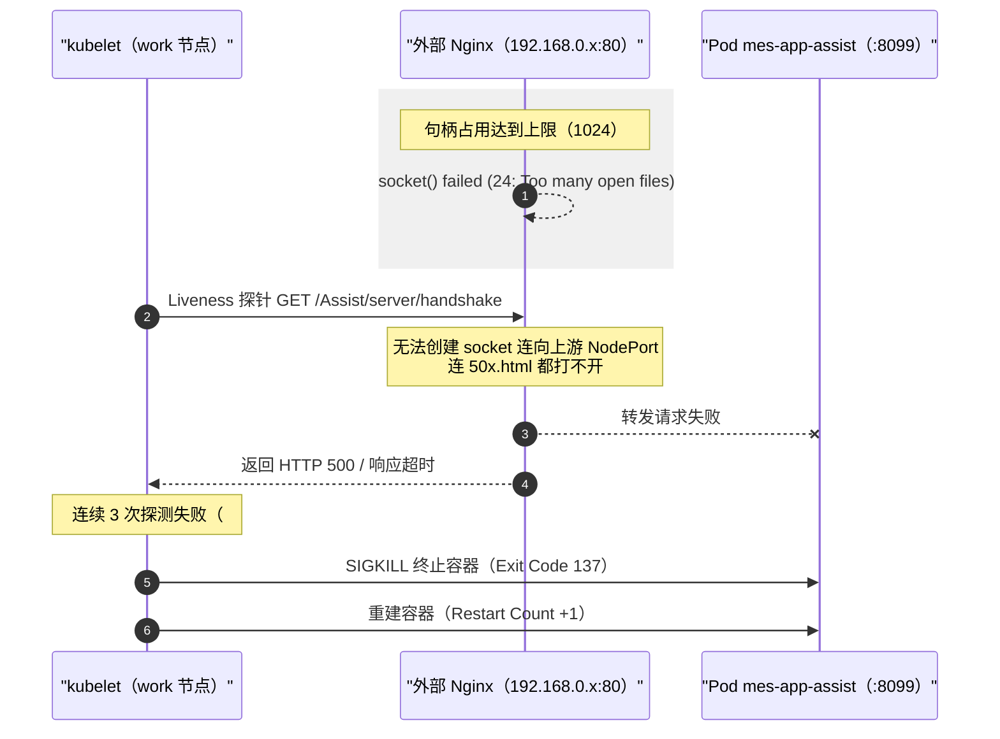
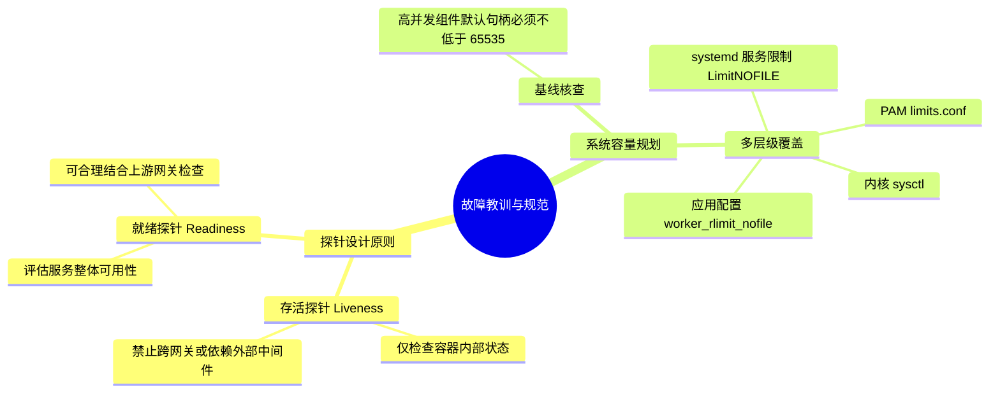

## 概述

一套跑在 K8s 上的 MES 系统里，辅助服务 Pod `mes-app-assist` 频繁重启：`kubectl describe pod` 显示容器因 Liveness 存活探针连续失败，被 kubelet 强行终止（退出码 137 / SIGKILL）。

- **故障现象**：Pod 反复重启，退出码 137 初看像 OOMKilled，但事件日志明确写着 `Liveness probe failed`；
- **根因**：外部接入层 Nginx 所在宿主机的文件描述符上限（`nofile`）过低——worker 进程软限制仅 1024。并发连接持续累积后，Nginx 报 `24: Too many open files`，既无法建立到后端 NodePort 的 socket 连接，连返回错误页 `50x.html` 的文件句柄都拿不到，经它转发的请求只能以 HTTP 500 或超时收场；
- **误杀机制**：该 Pod 的 Liveness 探针被配置成跨节点探测外部 Nginx 反代地址——外部网关句柄耗尽，被 kubelet 误判为容器死亡，**实际健康的后端容器被误杀重启**。外部故障沿着探针链路反向传导进了 K8s 内部。

<!-- more -->

## 一、故障现象

`kubectl describe pod` 取回容器状态与事件记录（IP 已脱敏，`192.168.0.x` 为 Nginx 所在节点，`192.168.0.y` 为 Pod 所在 work 节点）：

```yaml
Containers:
  mes-app-assist:
    State:          Running
      Started:      Fri, 09 Oct 2026 13:55:04 +0800
    Last State:     Terminated
      Reason:       Error
      Exit Code:    137
    Liveness:       http-get http://192.168.0.x/Assist/server/handshake delay=600s timeout=10s period=10s #success=1 #failure=3
    Readiness:      http-get http://:8099/Assist/server/handshake delay=20s timeout=10s period=5s #success=1 #failure=3

Events:
  Type     Reason     Age                  From                 Message
  ----     ------     ----                 ----                 -------
  Warning  Unhealthy  6m47s (x9 over 42d)  kubelet, k8s-work02  Liveness probe failed: HTTP probe failed with statuscode: 500
  Warning  Unhealthy  6m21s (x2 over 6m31s) kubelet, k8s-work02  Liveness probe failed: Get "http://192.168.0.x/...": net/http: request canceled (Client.Timeout exceeded while awaiting headers)
  Normal   Killing    6m21s                kubelet, k8s-work02  Container mes-app-assist failed liveness probe, will be restarted
```

两个关键发现：

1. **探针差异**：Readiness（就绪探针）直接探测本地容器端口 `8099`，而 Liveness（存活探针）却跨节点探测了外部反向代理 `192.168.0.x:80`——同一个 Pod 的两个探针，一个看容器自身，一个看整条外部链路；
2. **异常表现**：探针反复收到 HTTP 500 与 `Client.Timeout` 超时，达到阈值（`#failure=3`）后触发 `Killing`。

## 二、定位过程

### 2.1 从探针 URL 锁定排查对象

Readiness 正常、Liveness 失败，这一组合本身就把问题从"容器挂了"改写为"链路上除了容器还有谁"。Liveness 走的路径是 `kubelet → 外部 Nginx → NodePort → Pod`，容器自身恰恰是这条链上唯一健康的环节——排查对象顺理成章落到 Nginx 节点。

### 2.2 Nginx 错误日志实锤

登到 `192.168.0.x` 节点，`/usr/local/nginx/logs/error.log` 里大量高频 `alert` 与 `crit` 级别报错：

```text
2026/10/09 13:54:27 [alert] 28218#0: *481483468 socket() failed (24: Too many open files) while connecting to upstream, client: 192.168.0.y, server: 192.168.0.x, request: "GET /Assist/server/handshake HTTP/1.1", upstream: "http://192.168.0.x:30100/Assist/server/handshake", host: "192.168.0.x:80"
2026/10/09 13:54:27 [crit] 28218#0: *481483468 open() "/usr/local/nginx/html/50x.html" failed (24: Too many open files), client: 192.168.0.y, server: 192.168.0.x, request: "GET /Assist/server/handshake HTTP/1.1", upstream: "http://192.168.0.x:30100/Assist/server/handshake", host: "192.168.0.x:80"
```

- **错误码 24**（`Too many open files`）：操作系统拒绝再为该进程分配新的文件描述符；
- **级联影响**：不仅到后端 NodePort `30100` 的连接建立失败，连给客户端返回错误页 `50x.html` 时的磁盘读取句柄也被拒绝——这就是前端同时看到超时和 500 的原因：错误处理链路本身也是耗尽的。

### 2.3 句柄上限与水位验证

在同一台宿主机上核对限制值与实际占用：

```bash
# 1. 检查 Nginx worker 进程的资源限制（PID 28218）
[root@k8s-master01 ~]# cat /proc/28218/limits | grep "Max open files"
Max open files            1024                 4096                 files

# 2. 该 worker 进程当前已占用的句柄数
[root@k8s-master01 ~]# ls /proc/28218/fd | wc -l
874

# 3. 当前系统与 Shell 环境限制
[root@k8s-master01 ~]# ulimit -n
1024
```

实锤：worker 进程软限制仅 **1024**，而句柄占用已达 **874**——距离上限只剩 150 个，轻微的流量波动即可击穿上限。探针每 10 秒一次的探测请求，恰好成了压垮骆驼的稻草之一。

## 三、根因机制：跨层探针的级联误杀

先把退出码 137 说清楚：137 = 128 + 9，只代表进程收到了 SIGKILL，OOM 杀掉和 kubelet 探针失败杀掉都会产生它——本例若只盯退出码，排查就会从第一天起走错方向（去查容器内存）。真正的原因链是：



Pod 内的应用进程全程健康，却在每一次 Nginx 句柄告急时陪葬。**Liveness 探针跨越并依赖了外部 Nginx 代理链路，把一个外部单点故障级联传导成了 K8s 内部的容器重启循环**——这是本次故障真正的设计缺陷，句柄上限低只是触发条件。

## 四、修复与验证

按"紧急恢复 → 持久化配置 → 架构解耦"三个阶段处理。

### 4.1 紧急恢复：prlimit 在线调限

用 `prlimit` 在不重启 Nginx、业务不中断的前提下，动态提升运行中进程的句柄上限：

```bash
# 针对指定 worker 进程调整
prlimit --pid=28218 --nofile=65535:65535

# 批量调整所有 Nginx 相关进程
for pid in $(pgrep nginx); do prlimit --pid=$pid --nofile=65535:65535; done
```

### 4.2 持久化：三层配置缺一不可

**其一，Nginx 自身配置。** 编辑 `/usr/local/nginx/conf/nginx.conf`，在全局 `main` 上下文加 `worker_rlimit_nofile`；`events` 里的 `worker_connections` 同步从 1024 上调到 10240——单 worker 连接数上限与进程句柄上限是一对，只放开一头照样卡死；再给 upstream 开长连接复用，从源头降低句柄的创建销毁频率：

```nginx
user root;
worker_processes auto;
worker_rlimit_nofile 65535; # 显式提升 worker 进程句柄上限

events {
    worker_connections 10240; # 单 worker 最大连接数，由 1024 上调
}

http {
    upstream mes_backend {
        server 192.168.0.x:30100;
        keepalive 32; # 长连接复用，降低句柄频繁创建与销毁的开销
    }

    server {
        listen 80;
        server_name 192.168.0.x;

        location /Assist/ {
            proxy_pass http://mes_backend;
            proxy_http_version 1.1;
            proxy_set_header Connection "";
        }
    }
}
```

平滑重载：

```bash
/usr/local/nginx/sbin/nginx -t
/usr/local/nginx/sbin/nginx -s reload
```

**其二，systemd 服务定义。** 修改 `/usr/lib/systemd/system/nginx.service`，在 `[Service]` 区块添加 `LimitNOFILE`——**只改 `limits.conf` 对 systemd 拉起的服务无效**，systemd 不走 PAM 登录流程，服务级限制必须在 unit 文件里声明：

```ini
[Unit]
Description=nginx - high performance web server
After=network.target remote-fs.target nss-lookup.target

[Service]
Type=forking
PIDFile=/usr/local/nginx/logs/nginx.pid
ExecStartPre=/usr/local/nginx/sbin/nginx -t -c /usr/local/nginx/conf/nginx.conf
ExecStart=/usr/local/nginx/sbin/nginx -c /usr/local/nginx/conf/nginx.conf
ExecReload=/bin/kill -s HUP $MAINPID
ExecStop=/bin/kill -s QUIT $MAINPID
LimitNOFILE=65535

[Install]
WantedBy=multi-user.target
```

```bash
systemctl daemon-reload
```

**其三，系统级 `limits.conf`。** 兜住交互式登录与全局用户限制：

```bash
cat <<EOF>> /etc/security/limits.conf
* soft nofile 65535
* hard nofile 65535
root soft nofile 65535
root hard nofile 65535
EOF
```

### 4.3 架构解耦：探针回归本地端口

治本的一步——修改 `mes-app-assist` 的 Deployment，把 `livenessProbe` 改为**直接探测容器本地端口**，去掉对外部反向代理的依赖：

```yaml
spec:
  containers:
  - name: mes-app-assist
    image: <私有仓库>/mes-app-assist:20260827.1
    # 存活探针：只关注容器内部进程健康状态，不再绕经外部 Nginx
    livenessProbe:
      httpGet:
        path: /Assist/server/handshake
        port: 8099
      initialDelaySeconds: 600
      periodSeconds: 10
      timeoutSeconds: 10
      failureThreshold: 3
    # 就绪探针：保持原有配置
    readinessProbe:
      httpGet:
        path: /Assist/server/handshake
        port: 8099
      initialDelaySeconds: 20
      periodSeconds: 5
      timeoutSeconds: 10
      failureThreshold: 3
```

### 4.4 验证

三步确认，三个层面各归各位：

- `cat /proc/<pid>/limits | grep "Max open files"` 显示 65535——进程限制已生效；
- error.log 不再新增 `Too many open files` 的 alert/crit——容量已脱离危险水位；
- Pod 的 Restart Count 停止增长、`kubectl get pod` 事件里不再出现 `Unhealthy`——探针链路已与外部 Nginx 解耦。

## 五、复盘与改进



**探针职责必须明确。** Liveness 回答的是"容器是否挂死、是否需要重启"，必须直接访问容器本地端口（Pod IP），绝不能依赖外部网络或中间件（Nginx、API Gateway）——外部故障不应导致内部容器被误杀；Readiness 回答的是"容器能否接收流量"，如果要感知上游链路的可用性，正确位置也在这里：把 Pod 从 Endpoint 摘除，而不是触发重启。重启解决不了外部网关的句柄耗尽，只会让一个故障变成"故障 + 反复重启"。

**接入层容量要过基线核查。** 任何承载接入层流量的网关系统（Nginx、Envoy、HAProxy），上线时必须完成资源上限基线检查——默认的 1024 文件句柄限制在生产环境是严重安全隐患，应提升到 65535 或更高，且内核、systemd、PAM、应用配置多层同步覆盖：任何一层漏掉，都会在下次重启或换环境部署时把问题带回来。

## 结语

这次故障没有任何一个环节"坏了"：Nginx 只是句柄不够，kubelet 只是忠实地执行了探针规则，应用容器自始至终健康。危险的是那条被随手配出去的探针 URL——它把外部网关的健康状态，定义成了内部容器的生死。探针的边界，应该就是容器的边界。

这也补上了讲探针时的另一面：那里说的是 `initialDelaySeconds: 600` 的超长启动宽限——探针要对容器的慢启动宽容；这次的事故说的是另一半——**探针对容器的依赖要收窄**。一宽一窄，才是一个靠谱的探针配置。
