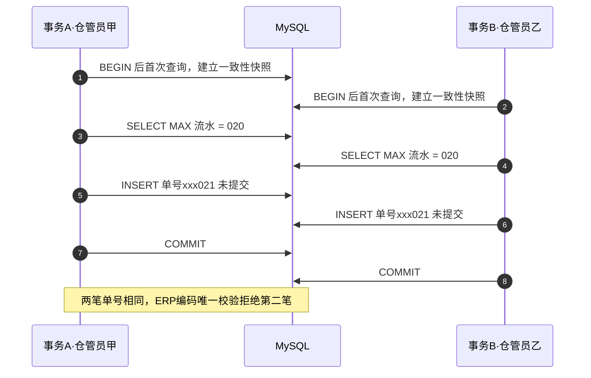

生产系统里最不起眼、又最容易在并发下翻车的代码，大概就是「查最大单号然后加一」这种两行取号。上周就撞上了一次：两位仓管员前后差 2 秒各做了一笔外部调拨，落库后**两张调拨单单号相同**，第二笔回写 ERP 时被对方系统以「编码唯一性要求：该编码已被使用」拒收。

排查根因、评估方案、换成 Redis 原子发号、真机并发压测验证，一路走下来，恰好把 Redis 的一大串面试高频考点串成了线。这篇文章先复盘事故与修复，再把考点一次讲透。

<!-- more -->

## 一、事故还原：MAX+1 取号为什么会重号

出事的取号逻辑抽象出来人手一份：

```java
// Service 类级 @Transactional，方法整体一个事务
int count = orderDao.getTodayMaxSeq(prefix) + 1;          // SELECT MAX(...)
order.setSequenceno(prefix + date + String.format("%03d", count));
orderDao.insert(order);                                    // 同事务插入
// ... 几百毫秒的后续业务：关联表插入、库存扣减、发消息 ...
// 方法返回后才 COMMIT
```

当天的事实数据：两笔调拨来自**两张不同的申请单**、不同物料、不同仓管员，maintaintime 仅差 2 秒。业务锁是按「申请单 ID」加的——不同申请单各拿各的锁，取号环节完全裸奔。

时序上是这样撞车的：



三个知识点叠在一起酿成事故：

1. **未提交的数据不可见**。MVCC 下事务 A 的 INSERT 在提交前，对事务 B 的普通 SELECT 完全透明，B 查到的 MAX 还是旧值。
2. **REPEATABLE READ 雪上加霜**。MySQL 默认 RR 隔离级别下，事务的读快照在**第一次查询**时就建立了——取号 SELECT 跑在事务中段，读的是方法开头扫条码时定格的旧世界。这意味着哪怕把取号动作串行化，后到的事务照样看不到对方刚提交的行（这一点直接毙掉了后面某个候选方案）。
3. **没有唯一索引兜底**。重复号静默落库，直到 ERP 用编码唯一性校验替我们发现。

我在测试库做了个只读复现：两个连接各自 `BEGIN` 后执行同一条当日 `SELECT MAX` 查询，拿到**完全相同的值**——机制实证，不用猜。

## 二、被否决的两个方案（每一个都是考点）

### 方案一：唯一索引 + 冲突重试，死在 Spring 事务回滚标记上

思路很顺：给单号列加唯一索引，插入撞 `DuplicateKeyException` 就重新取号重试。

死因：负责通用插入的 DAO 服务（框架类，不可改）自身是**类级 @Transactional**，与业务事务共用同一个物理事务。异常穿过这个内层事务代理的瞬间，Spring 就把共享事务标记为 **rollback-only**。外层把异常 catch 得再漂亮，重试的 INSERT 在 SQL 层面也会成功，但方法结束 commit 时抛 `UnexpectedRollbackException`——整个事务照样回滚。

这是 Spring 事务的经典陷阱：**同一事务内的「捕获-重试」救不了已被标记回滚的事务**。要么让重试逻辑跑在 `REQUIRES_NEW` 的新事务里，要么从根本上避免冲突发生。

### 方案二：分布式锁串行取号，三重坑

思路：取号前拿一把全局分布式锁，锁住「取号→提交」全程。坑在哪：

1. **tryLock 无参立即返回 false**。Redisson 的 `tryLock()` 不等待，抢不到直接失败——两个仓管员同时调拨是合法并发，却被「请勿重复操作」误拒，体验不可接受。
2. **释放时序对不上事务边界**。`finally` 里释放锁发生在方法返回**之前**，而 `@Transactional` 的提交发生在方法返回**之后**（AOP 代理包裹）。释放与提交之间的缝隙虽小，依然是个竞态窗口；要做对得上 `TransactionSynchronization` 的 afterCompletion 回调。
3. **最致命：锁住了也看不见**。回到第一节第 2 点——RR 快照在事务开头就定格了。就算取号被锁完美串行，后到事务的 `SELECT MAX` 读的仍是旧快照，照样取到重复号。要修还得给取号查询单独开 `REQUIRES_NEW`，复杂度已经超过问题本身。

两个方案否决下来，结论收敛：**必须让「取号」这个动作本身具备原子性，且不依赖当前事务的可见性**。

## 三、正确解法：Redis HINCRBY 原子发号

### 3.1 为什么一条 HINCRBY 就够了

Redis 命令执行是单线程的，`HINCRBY key field 1` 把「读-加-写」压成**一条命令**：两个客户端并发调用，Redis 串行执行，各自拿到不同的返回值——返回值就是自增后的新值，连「再 GET 一次」都不需要。不存在「同时读到同一个数」的物理可能。

发号器落在一个 Hash 结构上：

- **key**：发号器命名空间（按应用隔离，如 `serial:SerialNoHash`）
- **field**：单据类型（如 `WmsTransferOrder`，一种单据一个 field）
- **value**：当日流水计数

```java
// 取号一行
long seq = redisTemplate.opsForHash().increment(key, "WmsTransferOrder", 1);
String orderNo = "TZ" + yyyyMMdd + String.format("%04d", seq);
```

配套机制：

- **冷启动**：field 不存在时从数据库计数表回种当日值，再开始自增；
- **跨天**：号码本身就带日期（`前缀+yyyyMMdd+流水`），即使计数器忘了重置，不同日期的号码也绝不互撞；
- **持久化**：异步周期性把计数器落回数据库，Redis 数据丢失后按最后快照重播。


### 3.2 上线切换的三个工程细节

换成 Redis 发号不是改一行调用就完事，有三个细节决定上线是否平安：

**① 号码宽度变化是最好的切换护身符。** 新号码流水从 3 位变 4 位，新旧号码**字符串长度都不同**，结构上永不相同——任意时刻上线都不需要预置计数器。反过来，如果保持 3 位宽度，Redis 计数器必须先 `HSET` 种子为当日已发最大流水，否则从 001 开始发，当天就和存量撞号。**发号器切换时，先想清楚计数器起点和存量数据的关系。**

**② 号码会跳号。** 取号发生在事务之前，业务事务一旦回滚，号已消耗不再复用。MAX+1 的「连续」在并发下本来就是幻觉，业务上应可接受——但如果有审计要求单号严格连号，这方案直接不合格，得回到数据库序列/发号表方案。

**③ Redis 会失忆，唯一索引是最后防线。** 计数器从数据库快照重播时可能落后于已发号（异步落库间隙 + Redis 故障），短暂回退造成重号。所以**数据库唯一索引仍然必须加**——Redis 发号是性能与正确性的第一层，唯一索引是正确性的最后一层。两层防御，谁也别裸奔。

### 3.3 验证：修复前后的对照实验

- **修复前（机制复现）**：两个连接 `BEGIN` 后查当日 MAX，读到相同值，双双 +1 必得同号——旧机制非原子实锤；
- **修复后（真机压测）**：两路真并发调拨（不同申请单、同秒提交）单号 `0001/0002` 零重复；10 路并发建单全部成功，流水 `0001-0011` 连续无洞无重。最有说服力的细节：**单据自增 id 与流水号的对应关系是交错的**（id 大的反而流水号小）——取号与提交顺序确实乱序，正是旧机制下必撞车的条件，新机制下安然无恙。

## 四、Redis 面试高频考点串讲

一次事故串起的知识线，比背题库牢得多。以下按「从发号器出发能追问到什么」组织。

### 4.1 单线程模型与原子性（起点）

- **为什么 Redis 快**：纯内存操作 + 单线程无锁竞争与上下文切换 + IO 多路复用（epoll）。注意 6.0 的「多线程」只用于网络 IO 读写与协议解析，**命令执行仍然单线程**——所以单命令原子性没有被破坏。
- **单命令原子 ≠ 复合操作原子**：`INCR` 之后紧跟 `GET`，读到的不一定是自己刚 INCR 出来的值（中间可能插进别人的命令）——这是面试经典陷阱。解法要么用 INCR/HINCRBY 的**返回值**（如本文取号），要么 Lua/MULTI。
- **MULTI/EXEC vs Lua**：MULTI 中某条命令语法错误整体不执行，但**运行时错误（如对 String 做 LPUSH）不回滚已执行的**；Lua 脚本整体作为一条命令执行、中间可读分支判断，是实现「校验+删除锁」「限流」这类复合原语的标准答案。

### 4.2 用 Redis 做发号器/分布式 ID 的追问（高频）

- **持久化丢失会回退**：RDB 快照间隔或 AOF everysec 的 1 秒窗口内宕机，计数器回退 → 重号。这就是 3.2 ③ 必须配数据库唯一约束的原因。
- **主从切换丢写**：异步复制下主节点宕机，未同步到从库的自增值直接蒸发。等复制确认（`WAIT`）会牺牲吞吐，多数业务用「Redis 发号 + DB 唯一索引兜底」的组合拳。
- **对比雪花算法**：Snowflake 趋势递增、不依赖外部存储、QPS 高；代价是时钟回拨问题与 workerId 分配管理。面试答「单号场景优先 Redis 发号或号段模式，高并发 ID 场景 Snowflake/Leaf」即到位。可以补一句美团 Leaf 的号段模式：批量从 DB 取一段缓存在内存，DB 压力小且天然可回溯。

### 4.3 分布式锁（从事故中被否决的方案二延伸）

- **演进线**：`SETNX` + `EXPIRE` 两步不原子（宕机死锁）→ `SET key value NX EX 10` 一条命令搞定——这条演进链几乎是必考题。
- **锁误删**：A 超时锁过期，B 拿锁，A 回来 DEL 删掉了 B 的锁。解法：value 存随机标识，释放时 **Lua 校验「是自己的锁才删」**。
- **Redisson**：`lock()` 看门狗默认 30s、每 10s 自动续期，业务执行多久锁保多久；可重入（Hash 结构记重入次数）；`tryLock()` 无参**立即返回不等待**——适合「防重复提交」，不适合「必须拿到资源」的场景（本文事故里它被用作前者，粒度还只到单据级，拦不住跨单据的取号竞争）。
- **RedLock 争议**：Martin Kleppmann 质疑（时钟跳变、进程 GC 停顿下不安全）与 antirez 回应，结论是多数派共识难以成立；生产实践中单实例或主从+哨兵的 Redisson 已覆盖绝大多数场景，强一致锁需求上 ZooKeeper/etcd。

### 4.4 缓存三大问题（穿透/击穿/雪崩）

| 问题 | 触发条件 | 解法 |
|---|---|---|
| 穿透 | 查询**不存在**的数据，缓存永_miss打到 DB | 缓存空值（短 TTL）；布隆过滤器（位数组+k 哈希，无假阴性、有假阳性） |
| 击穿 | **单个热 key** 过期瞬间并发重建 | 互斥锁重建（一人查库余人等待）；逻辑过期（不设 TTL，值里带过期时间异步刷新） |
| 雪崩 | **大量 key 同时过期**或 Redis 整体不可用 | TTL 加随机值打散；多级缓存；熔断限流降级；集群高可用 |

三个词的区分标准就一个维度：**范围**——不存在的数据、单个热 key、一大片 key/整个实例。

### 4.5 持久化与高可用

- **RDB vs AOF**：RDB 是某时刻全量快照（fork 子进程 + 写时复制 COW，文件小恢复快，丢数据多）；AOF 是写命令追加（everysec 折中，最多丢 1 秒，文件大恢复慢，有重写压缩机制）。4.0 起**混合持久化**：RDB 全量做头 + 增量 AOF 追加，恢复快丢得少。重启加载 **AOF 优先**（更完整）。
- **主从复制**：首次全量（RDB + 缓冲增量），之后命令传播；`repl-backlog` 环形缓冲区决定断线是全量还是部分重同步。
- **哨兵**：主观下线（单个哨兵 ping 不通）→ 客观下线（quorum 法定人数确认）→ 选主（优先级→复制偏移量→runid）；**脑裂**防护靠 `min-replicas-to-write`——主节点发现从库跟不上就拒绝写入，避免旧主继续接受写造成数据丢失。
- **Cluster**：16384 个 slot 按 CRC16(key)%16384 分片；客户端拿到 MOVED 重定向（槽已迁走）或 ASK（迁移中临时重定向）；**hash tag** `{user1000}.orders` 强制同槽做多 key 操作；gossip 协议交换节点状态。

### 4.6 数据结构与典型场景（快速过一遍）

| 结构 | 典型场景 | 备注 |
|---|---|---|
| String | 计数器、缓存序列化对象、分布式锁 | INCR/HINCRBY 原子计数正是本文主角 |
| Hash | 对象的字段级读写、发号器多业务隔离 | 一个 key 下多个 field 独立自增 |
| List | 简单消息队列、最新列表 | LPUSH+BRPOP 阻塞消费；无 ACK，生产建议专业 MQ |
| Set | 去重、标签、共同关注（SINTER） | 交并差集运算 |
| ZSet | 排行榜、延迟队列（score=执行时间戳轮询） | 跳表+哈希实现，范围查询 O(logN) |

加分项：底层编码的自适应（小数据 ziplist/listpack 省内存，大了转 skiplist 等），能说出 7.0 用 listpack 全面替换 ziplist（解决级联更新）即可。

### 4.7 过期删除与内存淘汰

- **过期删除**：惰性删除（访问时查）+ 定期删除（默认每秒 10 次随机抽样过期 key），两者配合，不存在「到点精确删除」。
- **内存淘汰**（达到 maxmemory 时）：`noeviction`（默认，写报错）/ `volatile-*`（只在设了 TTL 的 key 中淘汰）/ `allkeys-*`（全部 key 中淘汰）× `lru`/`lfu`/`random`/`ttl` 共 8 种。缓存场景常用 `allkeys-lru`；发号器这类**绝不能丢**的 key 与缓存混部时，要么分开实例，要么淘汰策略选 `noeviction`——又一个「发号器专属」的工程细节。
- **LFU**：`lfu-log-factor` 越大计数增长越慢，适合访问频率差异大的场景；LFU 解决 LRU 的「偶发批量扫描污染缓存」问题。
- **大 key**：value 过大（如百万成员的 Set）删除会阻塞主线程（4.0+ 有 `UNLINK` 异步删除）；排查用 `redis-cli --bigkeys` / `MEMORY USAGE`。

## 五、小结

回到起点，把这次事故的可复用结论压成四句：

1. **「先查后写」的两步取号在并发下必然是重号温床**，MVCC 不可见性 + RR 快照 + 事务提交窗口三重叠加，业务锁粒度再细也护不住它；
2. **Redis 单命令原子性（INCR/HINCRBY）把取号压成一步**，返回值即新值，是单号场景的标准解；
3. **发号器切换先算计数器起点**：号码格式变了（宽度/长度）天然免疫存量冲突；格式不变必须预置种子值；
4. **永远留数据库唯一索引做最后防线**——Redis 持久化窗口、主从切换、淘汰策略都可能让发号器短暂失忆，唯一约束是那个永远不会失忆的裁判。

面试视角再多说一句：背 8 种淘汰策略不难，难的是被问到「你项目里为什么这么选」。从一次事故出发，单线程模型 → 原子命令 → 持久化丢失 → 高可用切换 → 分布式锁陷阱，每个考点都有了落点——这也是技术复盘的价值所在。
